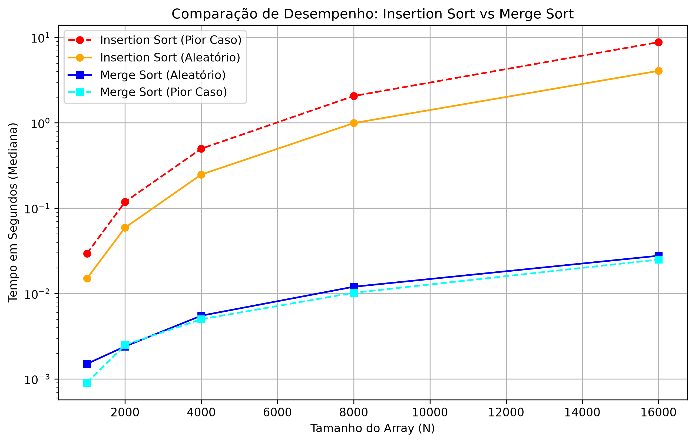

# Análise de Desempenho: Insertion Sort vs Merge Sort

## 🔍 O que investigamos

Neste projeto, investigamos e comparamos o tempo de execução de dois algoritmos de ordenação de naturezas diferentes: o **Insertion Sort** (complexidade de tempo O(n**2)) e o **Merge Sort** (complexidade de tempo (n log n)).

O objetivo foi observar como o desempenho de cada um escala na prática. Para garantir resultados sólidos, seguimos a seguinte metodologia:
*   **Tamanhos de entrada:** Medimos arrays de 5 tamanhos diferentes, dobrando a cada passo: 1.000, 2.000, 4.000, 8.000 e 16.000 elementos.
*   **Cenários testados:**
    *   *Entrada Aleatória:* Elementos gerados sem ordem aparente.
    *   *Pior Caso (Entrada Ordenada Inversamente):* Listas geradas em ordem decrescente, forçando o número máximo de comparações e trocas (especialmente no Insertion Sort).
*   **Controle de variáveis:** Fixamos uma semente (`random.seed(67)`) para reprodutibilidade. Realizamos 4 execuções por ponto de medição, **descartamos a primeira execução** (para evitar distorções de *warm-up* do sistema) e reportamos o resultado final baseado na **mediana** das 3 execuções restantes.

## 📊 O que encontramos

Através das medições (e visível no relatório gerado pelo terminal), pudemos constatar grandes diferenças práticas:

1.  **A explosão do algoritmo quadrático:** O Insertion Sort mostrou claramente a sua natureza O(n**2). À medida que o tamanho do array dobrava (ex: de 8.000 para 16.000), o tempo de execução não apenas dobrava, mas multiplicava de forma drástica.
2.  **O impacto do pior caso:** No cenário de lista inversamente ordenada, o Insertion Sort teve um desempenho significativamente pior do que no cenário aleatório, pois precisou arrastar cada elemento por todo o array a cada iteração.
3.  **A superioridade do Divisão e Conquista:** O Merge Sort foi ordens de grandeza mais rápido, especialmente nos tamanhos maiores de array (8.000 e 16.000). 
4.  **Estabilidade do Merge Sort:** Diferente do Insertion Sort, o Merge Sort entregou tempos excelentes e quase idênticos tanto para a entrada aleatória quanto para o cenário de pior caso, comprovando que sua complexidade O(n log n) é estável independente da organização prévia dos dados.



Gráfico com a comparação dos tempos que eu testei na minha máquina.
## ⚙️ Como rodar

O projeto utiliza bibliotecas nativas do Python (`asyncio`, `timeit`, `statistics`, `random`), portanto, não é necessário instalar dependências externas. Recomenda-se o uso do Python 3.9+ devido ao uso de `asyncio.to_thread`.

1. Clone ou baixe este repositório contendo os arquivos `main.py`, `insertionSort.py` e `mergeSort.py`.
2. Abra o seu terminal na pasta do projeto.
3. Execute o script principal:
OBS: dependendo da maquina pode ser mais lento o programa.

```bash
python main.py
```
## Configurações da minha máquina
Placa mãe: Asus tuf gaming b450m <br>
Memoria ram: 10gb <br>
Processador: Ryzen 5 5600G   <br>
GPU: AMD RX580 8GB <br>
OS: ArchLinux <br>